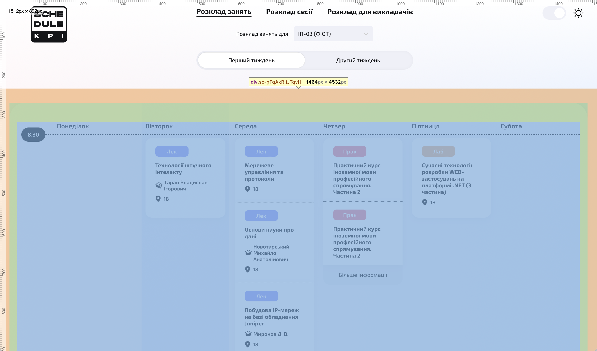

# How to use

1. Go to https://rozklad.kpi.ua in your web browser. Right-click and choose "Inspect" or "Inspect Element." Look for the timetable section in the code.
   It should be highlighted like this:
   
   Once you find it, save that part as an HTML file named `input.html`.

2. Find line 11 in `index.py` . Set the `WEEK` variable to the number of the week you are importing (`1` or `2`)
3. Run the script: `python index.py`
